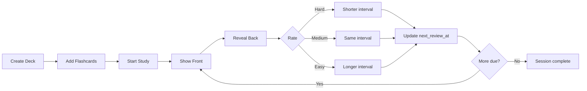

# Note-taking and flashcard app
_Exported on 7/6/2026 at 13:05:36 CDT from Cursor (3.9.16)_

---

**User**

I want to build an app that i can take notes and build flashcards to quiz myself on information i am trying to learn. i want it to have the ability to have questions show up more or less often depending on if i rate them easy, medium or difficult. I also want to be able to categorized the cards into different categories or decks. I would like to use react/django. help me write a plan and outline for this project so i can get started

---

**Cursor**

# Flashcard & Notes App — Project Plan

You’re describing a **notes + flashcard app with spaced repetition and deck organization**. React + Django is a solid choice. Below is a practical plan you can follow from zero to a working MVP.

---

## 1. What You’re Building (MVP Scope)

### Core features (v1)
| Feature | Description |
|---------|-------------|
| **Notes** | Create/edit/delete rich or plain-text notes |
| **Flashcards** | Front (question) + back (answer) per card |
| **Decks** | Group cards into categories/decks |
| **Quiz mode** | Show a card, reveal answer, rate Easy / Medium / Hard |
| **Spaced repetition** | Cards you mark Hard appear sooner; Easy cards appear later |
| **Auth** | Login so each user has their own notes/decks |

### Nice-to-have (v2+)
- Link notes to flashcards
- Import/export (CSV, Anki)
- Images on cards
- Study stats / streaks
- Tags in addition to decks
- Mobile-friendly PWA

Start with **auth, decks, cards, quiz, and rating-based scheduling** — that’s the heart of the app.

---

## 2. Tech Stack

| Layer | Choice | Why |
|-------|--------|-----|
| **Frontend** | React (Vite) | Fast dev, modern tooling |
| **UI** | Tailwind + shadcn/ui or MUI | Speed up forms, modals, layout |
| **State** | React Query (TanStack Query) | Server state, caching, refetch |
| **Routing** | React Router | Decks, quiz, notes pages |
| **Backend** | Django 5 + Django REST Framework | REST API, auth, ORM |
| **DB** | PostgreSQL | Reliable, good for relational data |
| **Auth** | JWT (djangorestframework-simplejwt) or session cookies | Pick one and stick with it |

---

## 3. Spaced Repetition — How Ratings Affect Frequency

You want **Easy / Medium / Hard** to change how often cards appear. Two common approaches:

### Option A: Simplified Leitner boxes (easiest to implement)
- Each card has a **box number** (1–5).
- **Hard** → move down (or stay in box 1)
- **Medium** → stay in same box
- **Easy** → move up one box
- Higher boxes = longer intervals before review

Example intervals (days): Box 1 → 1 day, Box 2 → 3 days, Box 3 → 7 days, Box 4 → 14 days, Box 5 → 30 days

### Option B: SM-2–style algorithm (more “real” SRS)
- Track **ease factor**, **interval**, and **next review date**
- Hard/Medium/Easy map to quality scores (e.g. 2, 3, 5)
- Industry standard (Anki-like); more math, better long-term behavior

**Recommendation for v1:** Start with **Leitner boxes** or a **fixed interval table** keyed by rating. You can swap in SM-2 later without changing the UI.

---

## 4. Data Model (Django)

```
User (Django auth)
  └── Deck
        ├── name, description, color?, created_at
        └── Flashcard
              ├── front, back
              ├── note (optional FK to Note)
              ├── box / ease_factor / interval (SRS fields)
              ├── next_review_at
              └── last_reviewed_at

Note (optional in v1, or simple from start)
  ├── title, content
  └── deck (optional FK)
```

### Suggested models (conceptual)

```python
# decks/models.py (conceptual)

class Deck(models.Model):
    user = models.ForeignKey(User, on_delete=models.CASCADE)
    name = models.CharField(max_length=200)
    description = models.TextField(blank=True)
    created_at = models.DateTimeField(auto_now_add=True)

class Note(models.Model):
    user = models.ForeignKey(User, on_delete=models.CASCADE)
    deck = models.ForeignKey(Deck, null=True, blank=True, on_delete=models.SET_NULL)
    title = models.CharField(max_length=200)
    content = models.TextField()
    created_at = models.DateTimeField(auto_now_add=True)
    updated_at = models.DateTimeField(auto_now=True)

class Flashcard(models.Model):
    user = models.ForeignKey(User, on_delete=models.CASCADE)
    deck = models.ForeignKey(Deck, on_delete=models.CASCADE, related_name='cards')
    front = models.TextField()
    back = models.TextField()
    note = models.ForeignKey(Note, null=True, blank=True, on_delete=models.SET_NULL)

    # Spaced repetition
    box = models.PositiveSmallIntegerField(default=1)  # Leitner
    next_review_at = models.DateTimeField(default=timezone.now)
    last_reviewed_at = models.DateTimeField(null=True, blank=True)
```

### Review log (optional but useful)
```python
class ReviewLog(models.Model):
    card = models.ForeignKey(Flashcard, on_delete=models.CASCADE)
    rating = models.CharField(choices=[('easy','Easy'),('medium','Medium'),('hard','Hard')])
    reviewed_at = models.DateTimeField(auto_now_add=True)
```

---

## 5. API Endpoints (Django REST Framework)

| Method | Endpoint | Purpose |
|--------|----------|---------|
| POST | `/api/auth/register/` | Sign up |
| POST | `/api/auth/login/` | Get token |
| GET/POST | `/api/decks/` | List/create decks |
| GET/PATCH/DELETE | `/api/decks/{id}/` | Deck detail |
| GET/POST | `/api/decks/{id}/cards/` | Cards in deck |
| GET/PATCH/DELETE | `/api/cards/{id}/` | Single card |
| GET | `/api/decks/{id}/study/` | **Due cards** for quiz (ordered by `next_review_at`) |
| POST | `/api/cards/{id}/review/` | Body: `{ "rating": "easy" \| "medium" \| "hard" }` → updates SRS |
| GET/POST | `/api/notes/` | Notes CRUD |

**Study flow:**
1. `GET /api/decks/3/study/?limit=20` → returns cards where `next_review_at <= now`
2. User sees front → reveals back → taps Easy/Medium/Hard
3. `POST /api/cards/42/review/` with rating → backend updates box/interval and `next_review_at`

---

## 6. SRS Logic (Backend Service)

Keep this in one place, e.g. `cards/services/srs.py`:

```python
INTERVALS_DAYS = {1: 1, 2: 3, 3: 7, 4: 14, 5: 30}

def apply_rating(card, rating: str):
    if rating == 'hard':
        card.box = max(1, card.box - 1)
    elif rating == 'medium':
        pass  # stay in box
    elif rating == 'easy':
        card.box = min(5, card.box + 1)

    days = INTERVALS_DAYS[card.box]
    card.next_review_at = timezone.now() + timedelta(days=days)
    card.last_reviewed_at = timezone.now()
    card.save()
```

Call this from the `review` endpoint only — don’t duplicate logic on the frontend.

---

## 7. Frontend Structure (React)

```
src/
  api/           # axios/fetch wrappers
  components/
    DeckList.tsx
  CardForm.tsx
  QuizCard.tsx      # flip + Easy/Medium/Hard buttons
  Layout.tsx
  pages/
    Login.tsx
    Dashboard.tsx   # deck list + “study due” counts
    DeckDetail.tsx  # cards in deck, add card
    Study.tsx       # quiz session
    Notes.tsx
  hooks/
    useDecks.ts
    useStudySession.ts
  App.tsx
  main.tsx
```

### Key screens
1. **Dashboard** — decks with “12 due” badge
2. **Deck detail** — list cards, add/edit, “Start study”
3. **Study session** — one card at a time, keyboard shortcuts (1=Hard, 2=Medium, 3=Easy)
4. **Notes** — simple editor; optional link “Create flashcard from selection” later

---

## 8. Project Layout (Monorepo or Split)

```
flashlearn/
  backend/          # Django project
    config/         # settings, urls
    decks/
    cards/
    notes/
    users/
  frontend/         # Vite + React
  docker-compose.yml  # postgres + optional dev services
  README.md
```

**Dev setup:**
- Backend: `localhost:8000`
- Frontend: `localhost:5173`
- CORS configured for React origin
- `VITE_API_URL=http://localhost:8000/api`

---

## 9. Implementation Phases

### Phase 1 — Foundation (Week 1)
- [ ] Django project + DRF + PostgreSQL
- [ ] User registration/login (JWT)
- [ ] `Deck` and `Flashcard` models + migrations
- [ ] CRUD API for decks and cards
- [ ] React app + auth + deck list page

### Phase 2 — Study & SRS (Week 2)
- [ ] `next_review_at` + review endpoint + SRS service
- [ ] Study page: fetch due cards, show quiz UI, submit ratings
- [ ] Dashboard “due count” per deck

### Phase 3 — Notes (Week 3)
- [ ] Note model + API
- [ ] Notes list/editor UI
- [ ] Optional: create card from note

### Phase 4 — Polish (Week 4)
- [ ] Error handling, loading states
- [ ] Basic stats (cards studied today)
- [ ] Deploy (Railway/Fly.io + Vercel, or single VPS)

---

## 10. Decisions to Make Early

| Decision | Suggestion |
|----------|------------|
| Auth | JWT for SPA; simpler if you only use one domain later |
| Card content | Plain text first; markdown second |
| One deck vs many per card | **One deck per card** for v1 |
| New cards | `next_review_at = now` so they appear immediately in study |
| Empty study session | “No cards due — review all anyway?” optional mode |

---

## 11. Example User Flow



---

## 12. Getting Started Checklist (Day 1)

1. Create repo with `backend/` and `frontend/` folders  
2. `django-admin startproject` + install `djangorestframework`, `django-cors-headers`, `djangorestframework-simplejwt`  
3. `npm create vite@latest frontend -- --template react-ts`  
4. Define `Deck` and `Flashcard` models; run migrations  
5. Build deck list + one “add card” form in React  
6. Add `/study/` and `/review/` endpoints with Leitner logic  
7. Build minimal quiz screen with three rating buttons  

---

## 13. Resources

- [Django REST Framework tutorial](https://www.django-rest-framework.org/tutorial/quickstart/)
- [TanStack Query docs](https://tanstack.com/query/latest)
- [SM-2 algorithm](https://www.supermemo.com/en/archives1990-2015/english/ol/sm2) — if you upgrade SRS later
- Leitner system — search “Leitner box spaced repetition” for simple explanations

---

## Summary

| Piece | Approach |
|-------|----------|
| **Stack** | React (Vite) + Django REST + PostgreSQL |
| **Organization** | Decks with flashcards (notes optional layer) |
| **Quiz** | Due cards by `next_review_at`, rate Easy/Medium/Hard |
| **SRS v1** | Leitner boxes + day intervals |
| **Order of work** | Auth → Decks/Cards CRUD → Study + SRS → Notes → Polish |

If you want to go deeper next, I can help with: (1) a full Django `models.py` + serializers sketch, (2) the exact `study` and `review` API contract, or (3) a week-by-week task breakdown with file names. I'm in **Ask mode** — switch to **Agent mode** if you want me to scaffold the project structure in a repo for you.

